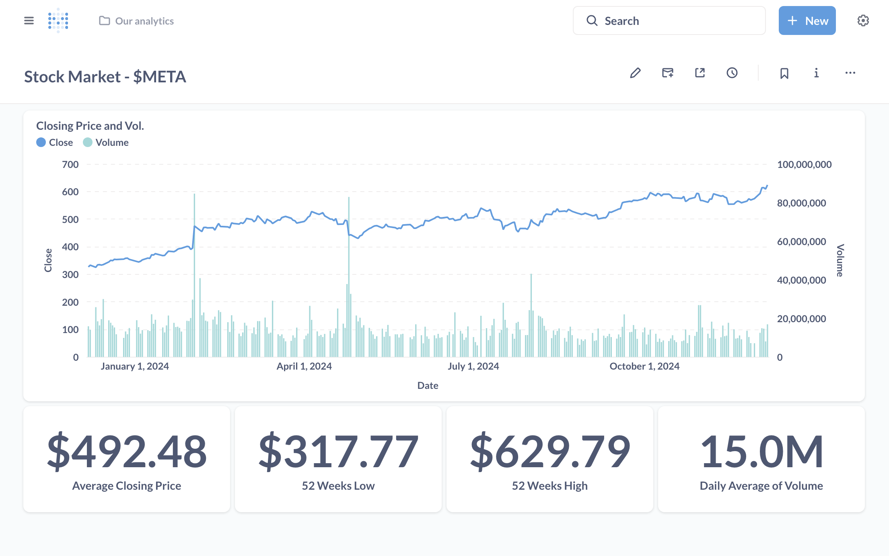

# Stock Market Data Pipeline Project

This repository showcases an end-to-end data pipeline built using **Apache Airflow**, **Apache Spark**, and **Metabase**. The pipeline is designed to fetch, process, and load stock market data into a data warehouse, providing insightful dashboards in Metabase.

## Overview

The pipeline automates the following steps:

1. Fetches stock prices from an API.
2. Stores the raw data in an S3-compatible MinIO bucket.
3. Formats the data using Apache Spark.
4. Loads the formatted data into a PostgreSQL database (data warehouse).
5. Visualizes the processed data in **Metabase dashboards**.

---

## Pipeline Steps

The **DAG** (`stock_market`) orchestrates the following tasks:

1. **Check API Availability**:
   - A sensor task checks if the stock API is available before proceeding.
   - Utilizes the `is_api_available` sensor.

2. **Fetch Stock Prices**:
   - A Python task fetches stock prices for a specific symbol (e.g., `META`) from the API.
   - Task: `get_stock_prices`

3. **Store Raw Prices in MinIO**:
   - The fetched JSON data is stored in a MinIO bucket under the symbol's folder.
   - Task: `store_prices`

4. **Format Prices using Apache Spark**:
   - A DockerOperator runs a Spark job to format the JSON data into CSV.
   - Task: `format_prices`

5. **Retrieve Formatted CSV**:
   - The pipeline retrieves the formatted CSV from the MinIO bucket.
   - Task: `get_formatted_csv`

6. **Load Data into PostgreSQL**:
   - The formatted CSV is loaded into a PostgreSQL database (`stock_market` table) using Astro's `load_file`.
   - Task: `load_to_dw`

7. **Dashboard Visualization**:
   - The processed data is visualized in **Metabase**, showing trends and analysis of the stock market data.

---

## Results in Metabase

The **Metabase dashboard** visualizes the stock market data, providing insights such as:
- Daily Closing Price and Volume Graph
- 52 Weeks high/low prices
- Average Closing Price
- Average Daily Volume

---

## Prerequisites

- [Astronomer CLI](https://docs.astronomer.io/astro-cli) installed.
- Docker installed and running.
- PostgreSQL, MinIO, and Metabase running in Docker.

---
